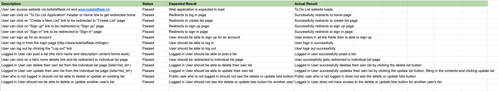

# T4A2 - Full Stack Application - Part B

The purpose of the To Do List Application is to help developers to prioritize their work tasks.

The website is targeted at developers who want a public to do list that they can share with their colleagues.  It is open to the public to read your lists, however you will need to sign up for an account in order to post your own list. You can only delete and edit your own lists.

 

# Links
* [Deployed Website](http://www.todolistflask.ml/)
* [Github Repo](https://github.com/GabrielWongAu/To-Do-List-Application)

 

# How to install this app
### How to setup the Flask application & PostgreSQL Database

#### Flask Application Installation (on application host machine)

**Step 1.** Install Python 3.8, python3-pip and python3.8-venv

    sudo apt install python3.8, python3.8-venv, python3-pip

**Step 2.** Clone GitHub repo to local project folder and Change Directory

    git clone https://github.com/GabrielWongAu/To-Do-List-Application.git

    cd To-Do-List-Application

**Step 3.** Create and activate virtual environment

    python -m venv venv
    
    source venv/bin/activate

**Step 4.** Install dependencies

    pip install -r requirements.txt

#### Setting up PostgreSQL database (on database host machine)

**Step 1.** Update package information on database host machine

    sudo apt update
   
**Step 2.** Install PostgreSQL on database host machine

    sudo apt install postgresql

**Step 3.** Change user to postgres

    sudo -i -u postgres
   
**Step 4.** Open PostgreSQL logged in as admin/superuser (generally postgresql)

    psql postgres
   
**Step 5.** Create new database
   
    CREATE DATABASE to_do_list_db

**Step 6.** Create new user

    CREATE ROLE flaskuser

**Step 7.** Grant all privileges on new database to the new user

    GRANT ALL PRIVILEGES ON DATABASE to_do_list_db TO flaskuser

**Step 8.** Add password for new user

    ALTER USER flaskuser WITH ENCRYPTED PASSWORD '<PASSWORD>'

#### Running the Flask Application

**Step 1.** Copy .env.example and rename it to .env in the root directory. Update the necessary variables.

**Step 2.** Export the environment variables `FLASK_APP` and `FLASK_ENV` if not done through the .env file

    export FLASK_APP="main:create_app()"
    export FLASK_ENV=development

**Step 3.** Initialise database migrations

    flask db init

**Step 4.** Run migrations to update database

    flask db upgrade

**Step 5.** Run flask app

    flask run

#### Create the database

* Run the following command to create the database
   
    `flask db-custom create`

#### Seed the database

* Run the following command to seed the database with some example users and lists
   
    `flask db-custom seed`

#### Drop all tables in the database

* Run the following command to drop all tables in the database

    `flask db-custom drop`

### Available Endpoints

#### Users

**POST /auth/register/**

    Register a new user

    Input:
    - username
    - password

**POST /auth/login/**

    Login existing user

    Input:
    - username
    - password

#### Lists Endpoints

**GET /lists/**

    View all lists

**POST /lists/**

    Create a new list

    Input:
    - name
    - description

**PUT or PATCH /lists/update/\<id>**

    Update existing list - Authorisation required

    Input:
    - name
    - description

**DELETE /lists/delete/\<id>**

    Delete existing list - Authorisation required

### **Requirement 1: Use appropriate libraries**

### Libraries Used

#### Flask libraries
* **Flask Sqlalchemy** - similar to the core SQLAlchemy package, Flask-SQLAlchemy provides an ORM to modify application data by easily creating defined models. 
* **Flask Marshmallow** - Marshmallow is an ORM/ODM/framework-agnostic library for converting complex data types, such as objects, to and from native Python data types. Marshmallow schemas can be used to validate input data, de-serialize input data to app-level objects and serialize app-level objects to primitive Python types. Flask-Marshmallow is a thin integration layer for Flask (a Python web framework) and marshmallow (an object serialization/deserialization library) that adds additional features to marshmallow, including URL and Hyperlinks fields for HATEOAS-ready APIs. 
* **Flask Bcrypt** -  a Flask extension that provides bcrypt hashing utilities for your application. 
* **Flask Login** - provides user session management for Flask. It handles the common tasks of logging in, logging out, and remembering your users’ sessions over extended periods of time.
* **Flask WTF / CSRFProtect** - provides CSRF protection. 

#### Built-in libraries
*	**Json** – a built-in Python package that works with JSON data.
    *	I have used the json module to decode the JSON data from the API requests.
*	**Os** – Python’s built in miscellaneous operating system interfaces 
    *	Sys and os have been used to print to the centre of the screen.

#### Other libraries
* **Bootstrap** - the most popular HTML, CSS, and JavaScript framework for developing responsive, mobile-first websites. 
* **Gunicorn** - a Python WSGI HTTP Server for UNIX. It's a pre-fork worker model. The Gunicorn server is broadly compatible with various web frameworks, simply implemented, light on server resources, and fairly speedy.
* **Psycopg2** - Psycopg is the most popular PostgreSQL database adapter for the Python programming language. 
* **Python Dotenv** - Reads key-value pairs from a .env file and can set them as environment variables. It helps in the development of applications following the 12-factor principles.
 

### **Requirement 3. Project Management/ Task Delegation Methodology**

 

**Day 0** 

 

 

**Day 1** 

 

 

 

**Day 2** 

 

 

 

**Day 3** 

 

 

 

**Day 4** 

 

 

 

**Day 5** 

 

 

### **Requirement 8 b): Provides evidence of user testing in the development environment**

 

See Requirement 9 below

 

### **Requirement 8 b): Provides evidence of user testing in the production environment**

 

 

### **Requirement 9: Utilise a formal testing framework**

 

**Backend Tests** 

    python3.8 -m unittest discover -s backend_tests

**Frontend Tests** 

    python3.8 -m unittest discover -s frontend_tests

